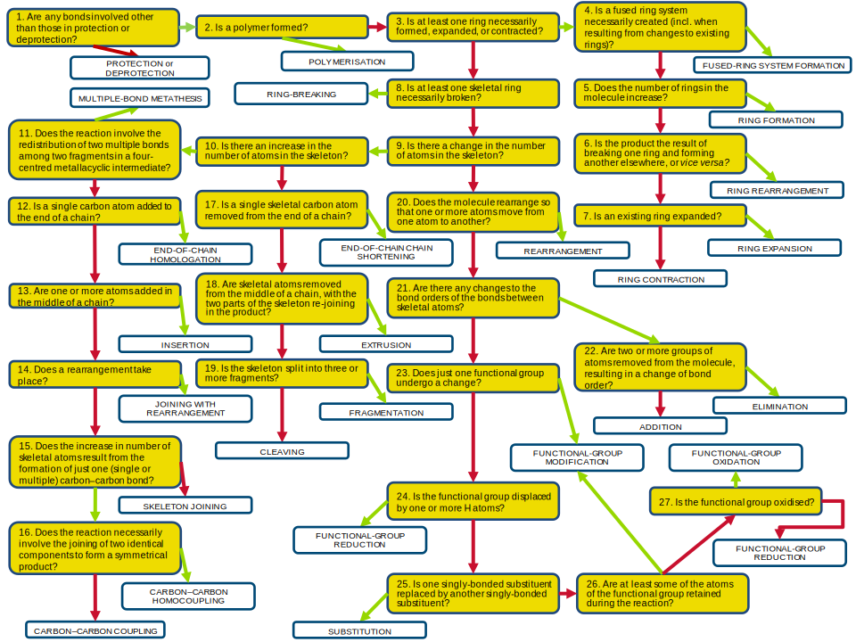

1. Are any bonds involved other than those in protection or deprotection?
N: PROTECTION or DEPROTECTION
Y: 2

2. Is a polymer formed?
N: 3
Y: POLYMERISATION

3. Is at least one ring necessarily formed, expanded, or contracted?
N: 8
Y: 4

4. Is a fused ring system necessarily created (incl. when resulting from changes to existing rings)?
N: 5
Y: FUSED-RING SYSTEM FORMATION

5. Does the number of rings in the molecule increase?
N: 6
Y: RING FORMATION

6. Is the product the result of breaking one ring and then forming another elsewhere, or vice versa?
N: 7
Y: RING REARRANGEMENT

7. Is an existing ring expanded?
N: RING CONTRACTION
Y: RING EXPANSION

8. Is at least one skeletal ring necessarily broken?
N: 9
Y: RING-BREAKING

9. Is there a change in the number of atoms in the skeleton?
N: 20
Y: 10

10. Is there an increase in the number of atoms in the skeleton?
N: 17
Y: 11

11. Does the reaction involve the redistribution of two multiple bonds among two fragments in a four-centred metallacyclic intermediate?
N: 12
Y: MULTIPLE-BOND METATHESIS

12. Is a single carbon atom added to the end of a chain?
N: 13
Y: END-OF-CHAIN HOMOLOGATION

13. Are one or more atoms added in the middle of a chain?
N: 14
Y: INSERTION

14. Does a rearrangement take place?
N: 15
Y: JOINING WITH REARRANGEMENT

15. Does the increase in number of skeletal atoms result from the formation of just one (single or multiple) carbon-carbon bond?
N: SKELETON JOINING
Y: 16

16. Does the reaction necessarily involve the joining of two identical components to form a symmetrical product?
N: CARBON-CARBON COUPLING
Y: CARBON-CARBON HOMOCOUPLING

17. Is a single skeletal carbon atom removed from the end of a chain?
N: 18
Y: END-OF-CHAIN CHAIN SHORTENING

18. Are skeletal atoms removed from the middle of a chain, with the two parts of the skeleton re-joining in the product?
N: 19
Y: EXTRUSION

19. Is the skeleton split into three or more fragments?
N: CLEAVING
Y: FRAGMENTATION

20. Does the molecule rearrange so that one or more atoms move from one atom to another?
N: 21
Y: REARRANGEMENT

21. Are there any changes to the bond orders of the bonds between skeletal atoms?
N: 23
Y: 22

22. Are two or more groups of atoms removed from the molecule, resulting in a change of bond order?
N: ADDITION
Y: ELIMINATION

23. Does just one functional group undergo a change?
N: 24
Y: FUNCTIONAL-GROUP MODIFICATION

24. Is the functional group displaced by one or more H atoms?
N: 25
Y: FUNCTIONAL-GROUP REDUCTION

25. Is one singly-bonded substituent replaced by another singly-bonded substituent?
N: 26
Y: SUBSTITUTION

26. Are at least some of the atoms of the functional group retained during the reaction?
N: 27
Y: FUNCTIONAL-GROUP MODIFICATION

27. Is the functional group oxidised?
N: FUNCTIONAL-GROUP REDUCTION
Y: FUNCTIONAL-GROUP OXIDATION

Version 11
DJB
10th Oct 2008
